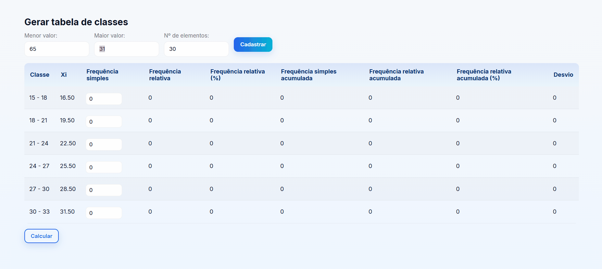

# Cálculos Da Estatística Descritiva para Dados Agrupados em Classes.

Programa que realiza os cálculos da estatística descritiva para dados agrupados em classes, incluindo o cálculo das classes e montagem da tabela ( média, mediana, moda, variância, desvio padrão e coeficiente de variação, bem como os cálculos das frequências relativas, relativas percentuais, acumulada, acumulada relativa e acumulada relativa percentual).

## Tabela de Conteúdos

- [Visão Geral](#visão-geral)
    - [Imagens](#imagens)
    - [Link da página](#link)
- [Processo](#processo)
    - [Linguagens utilizadas](#linguagens-utilizadas)
    - [O que aprendi](#o-que-aprendi)
    - [Possíveis evoluções](#possíveis-evoluções)
- [Autor](#autor)

## Visão-geral

### Imagens

<br>

````
Versão de Desktop
````

   

<br>


### Link

- Página no GitHub Pages: <a href="https://julio-mansan2.github.io/tabela_de_classes">Clique aqui!</a>

## Processo

### Linguagens utilizadas

<br>

- Vanilla JavaScript.


## Autor

GitHub - <a href="https://github.com/julio-mansan2">julio-mansan2</a> <br>